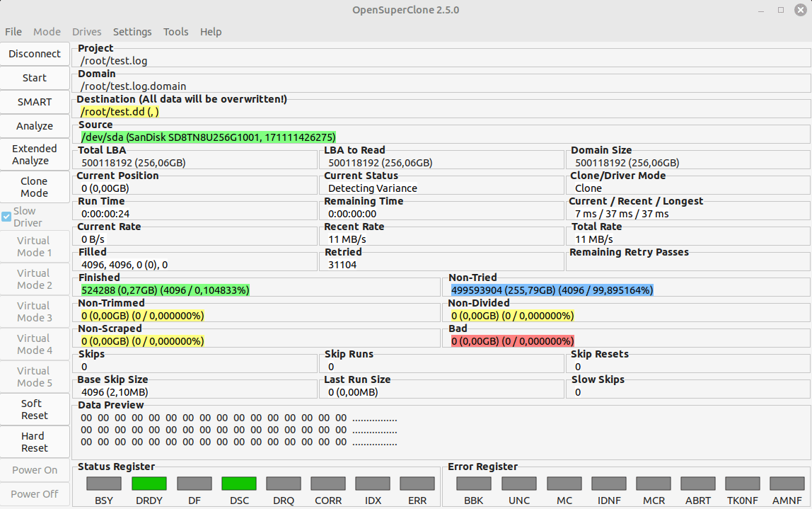

<h1 align="center">
   
  OpenSuperClone
   
</h1>

  
  
  
  
  

<h4 align="center">
  A powerful disk cloning utility for Linux with many advanced features based on <a href="https://www.hddsuperclone.com/">Scott Dwyer's HDDSuperClone</a>.
</h4>

  <a href="#-features">✨ Features</a> •
  <a href="#-installation">💾 Installation</a> •
  <a href="#-documentation">📖 Documentation</a> •
  <a href="#%EF%B8%8F-changelog">✏️ Changelog</a> •
  <a href="#-credits">💵 Credits</a> •
  <a href="#-license">📄 License</a>

  

## ✨ Features

* Advanced drive <a href="https://github.com/ISpillMyDrink/OpenSuperClone/wiki/Clone-Mode">cloning</a> capability akin to that of ddrescue
* <a href="https://github.com/ISpillMyDrink/OpenSuperClone/wiki/Virtual-Disk-Mode">Virtual Disk Mode</a> for targeted data extraction
* <a href="https://github.com/ISpillMyDrink/OpenSuperClone/wiki/Direct-Modes">Direct AHCI/IDE</a> capability to circumvent OS drivers
* <a href="https://github.com/ISpillMyDrink/OpenSuperClone/wiki/Relay-Operation">USB Relay Control</a> for automatic power cycling of drives

#### 📋 Planned Changes

* Refactoring of codebase
* Remove requirement for running as root
* Add configuration files and presets

## 💾 Installation

Pre-built DEB and RPM packages for OpenSuperClone can be found on the <a href=https://github.com/ISpillMyDrink/OpenSuperClone/releases>Release</a> page.

Instructions for installing OpenSuperClone from source can be found on the <a href="https://github.com/ISpillMyDrink/OpenSuperClone/wiki/Compiling-from-Source">Wiki</a>.

## 📖 Documentation

Documentation for OpenSuperClone can be found on the <a href="https://github.com/ISpillMyDrink/OpenSuperClone/wiki">Wiki</a>.
Note that the Wiki is currently a work-in-progress and incomplete.

## ✏️ Changelog

#### OpenSuperClone 2.5 [Work-In-Progress]

* Implemented DKMS for driver installation
* OSCDriver 2.6.3: add support up to kernel 6.3.1 (thanks to <a href="https://github.com/piernov/">piernov</a>)
* added tooltips to most UI elements

#### OpenSuperClone 2.4.1

* Fixed a bug where the UI labels would show bogus strings

#### OpenSuperClone 2.4

* Removal of licensing related code
* Implemented CMake as build system
* Switched from GTK2 to GTK3
* Replaced localization system with gettext
* OSCDriver 2.6.1: add support up to kernel 5.19.11 (thanks to <a href="https://github.com/piernov/">piernov</a>)
* Minor improvements to OSCViewer (color picker, minor graphical changes)

## 💵 Credits

Credit belongs to Scott Dwyer for his excellent work on <a href="https://www.hddsuperclone.com/">HDDSuperClone</a>,
and <a href="https://github.com/piernov/">piernov</a> for his work on updating the kernel module.

This project makes use of the following libraries/programs:
* GLADE (https://glade.gnome.org/)
* GTK (https://www.gtk.org/)
* libconfig (https://hyperrealm.github.io/libconfig/)
* libintl (https://www.gnu.org/software/gettext/)
* libusb (https://libusb.info/)
* Font Awesome (https://fontawesome.com/)

## 📄 License

This software is licensed under the [GPLv2](LICENSE).
